# MediSync

MediSync is a full-stack Android healthcare application that connects patients and doctors through appointment booking, real-time chat, video consultation, AI health assistance, clinic location, and medical record management.

The project includes a **Kotlin + Jetpack Compose Android app** and a **Node.js + TypeScript backend** with PostgreSQL, MinIO, Redis, WebSockets, Firebase, and Gemini API integrations.

---

## Features

### Patient

- OTP based login and role based onboarding
- Search doctors by speciality
- View doctor profile, ratings, clinic location, and consultation mode
- Book online or offline appointment slots
- View appointment list and appointment details
- Chat with doctors in real time
- Join video consultations
- Upload and view medical records
- Ask health-related questions using the AI assistant

### Doctor

- Manage personal, professional, and clinic profile
- Set clinic location using map picker
- Create weekly slot templates and custom schedules
- View patient appointments
- Chat with patients
- Join video consultations
- Receive appointment and chat notifications

### Backend

- JWT protected APIs
- PostgreSQL database with relational schema
- WebSocket based chat and video signaling
- MinIO object storage for profile photos and medical records
- Firebase Cloud Messaging for push notifications
- Redis support for real-time services
- Cron based slot generation

---

## Tech Stack

| Layer | Technology |
|---|---|
| Android | Kotlin, Jetpack Compose, MVVM, Room/SQLite |
| Backend | Node.js, Express.js, TypeScript |
| Database | PostgreSQL |
| File Storage | MinIO |
| Realtime | WebSocket |
| Notifications | Firebase Cloud Messaging |
| Authentication | Firebase OTP, JWT |
| AI | Google Gemini API |
| Maps | Google Maps SDK |
| Deployment | Docker, PM2, Linux Cloud Server |

---

## Screenshots

### Patient Flow

| Login | Patient Home | Find Doctor |
|---|---|---|
| 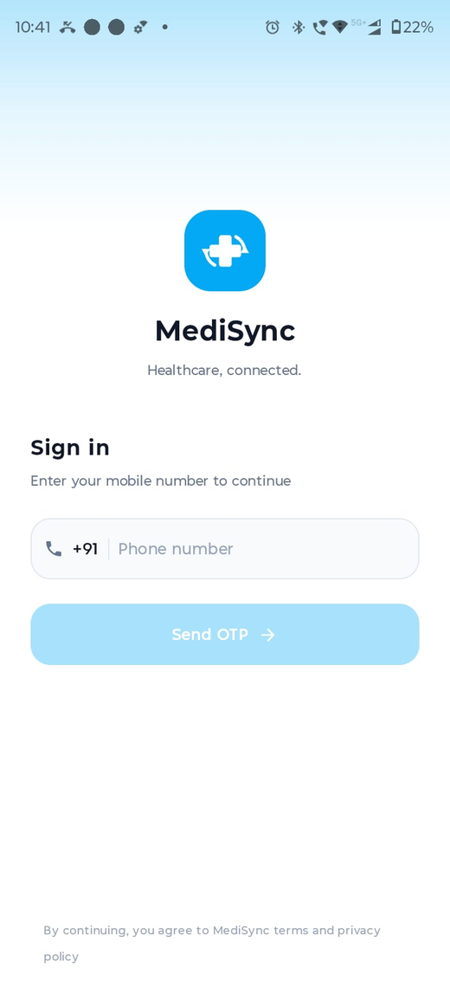 | 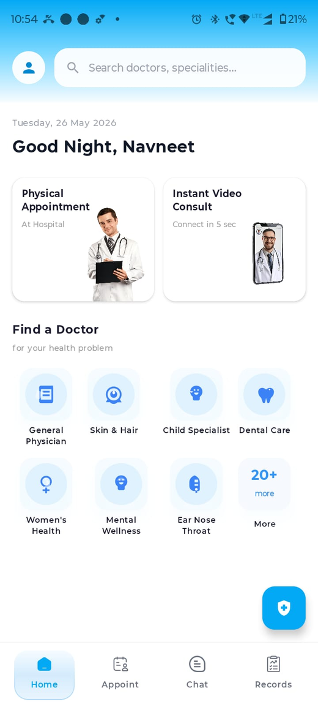 | 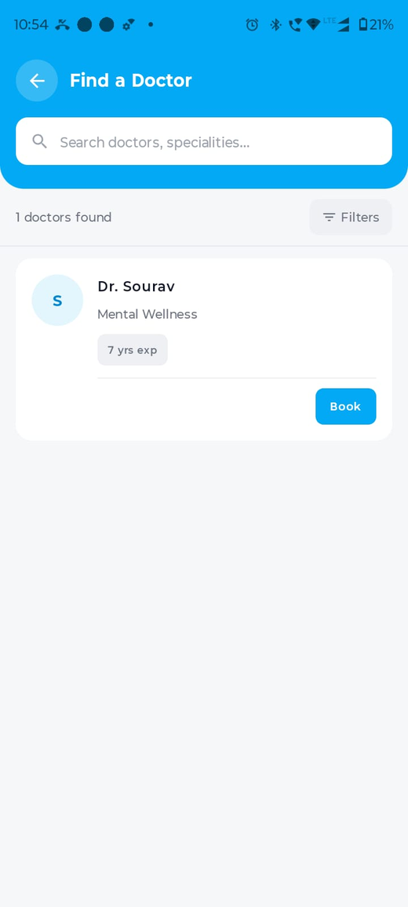 |

| Doctor Profile | Slot Booking | Appointment Detail |
|---|---|---|
| 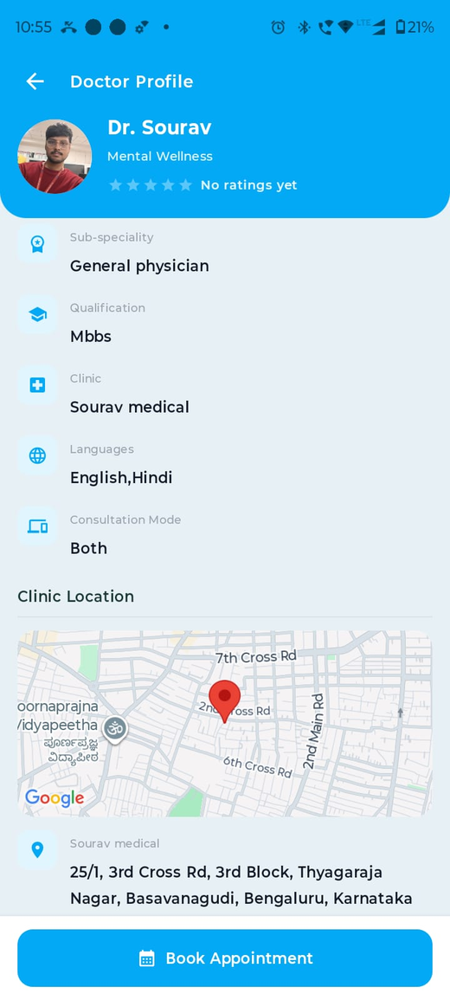 | 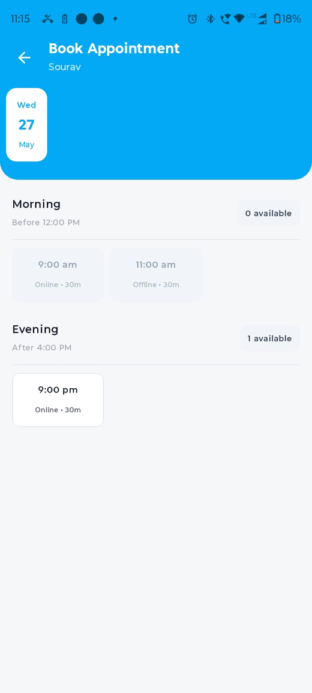 | 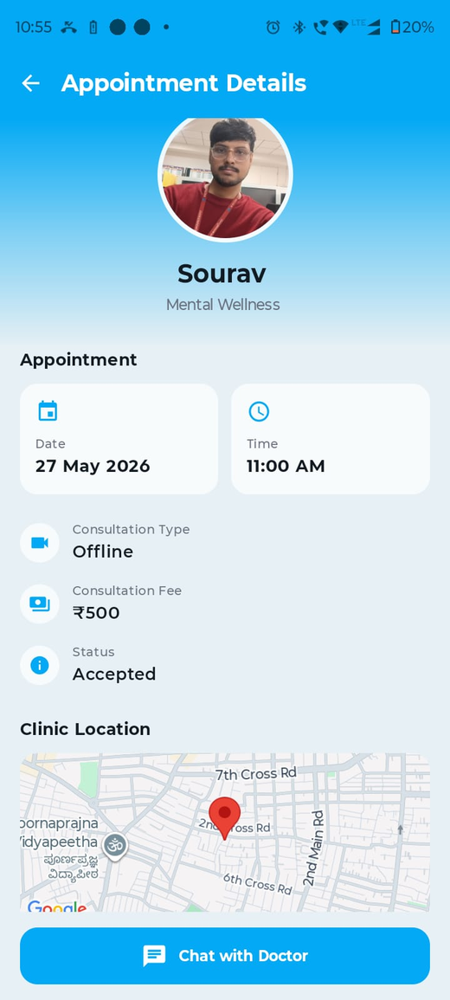 |

| Chat | Video Call | Medical Records |
|---|---|---|
| 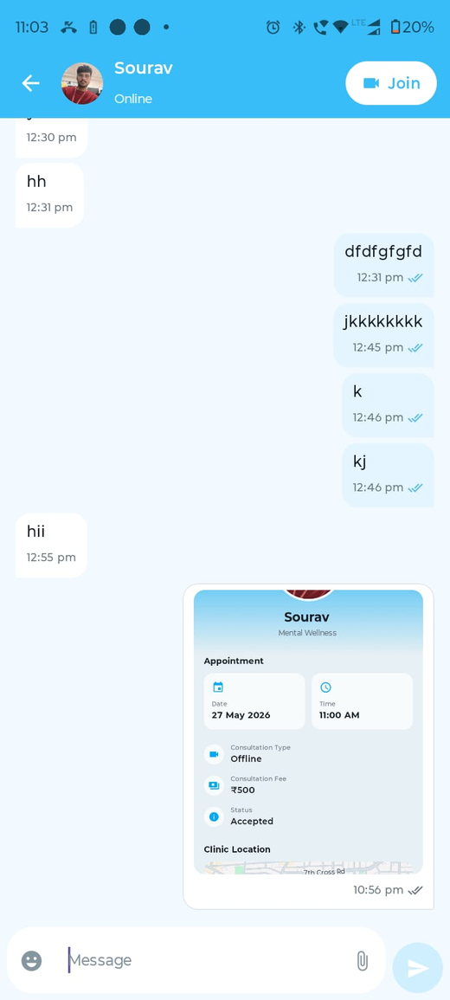 | 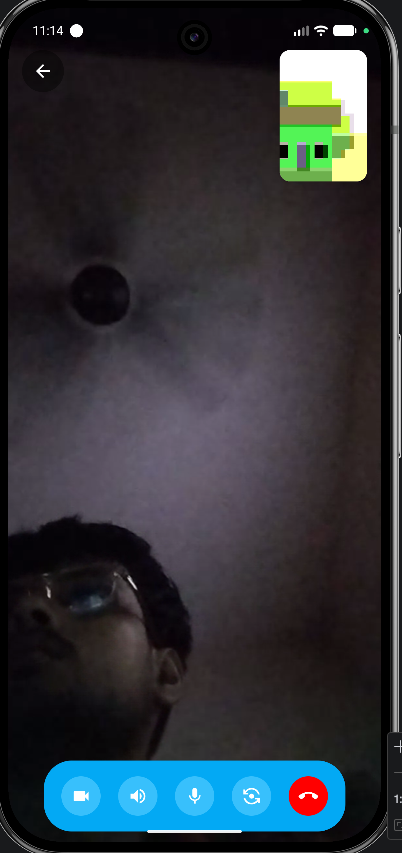 | 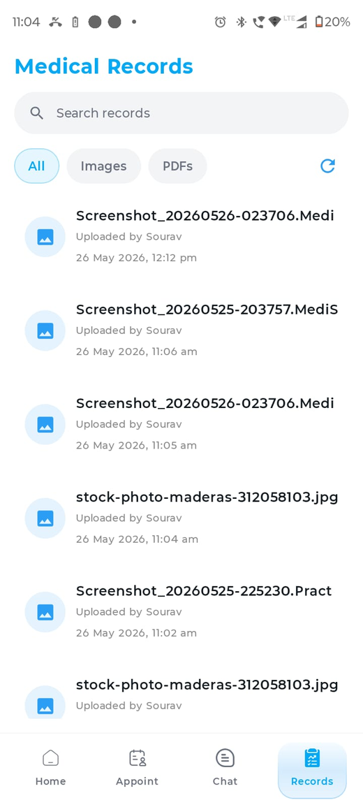 |

### Doctor And AI Flow

| AI Chat | Doctor Home | Slot Management |
|---|---|---|
| 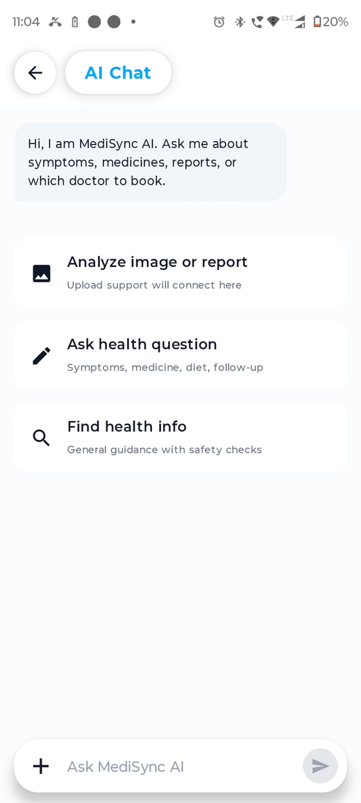 | 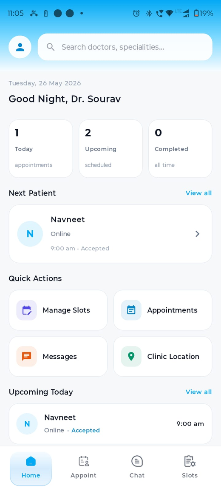 | 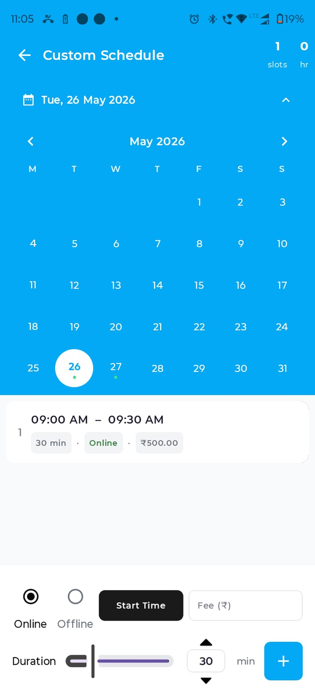 |

---

## Database Design

MediSync uses PostgreSQL for structured data and MinIO for binary files such as profile photos, reports, images, and PDFs.

Key tables include:

- `users`
- `patient_personal`
- `patient_medical`
- `patient_lifestyle`
- `doctor_personal`
- `doctor_professional`
- `doctor_clinic`
- `appointment_slots`
- `appointments`
- `chat_rooms`
- `chat_messages`
- `medical_reports`
- `doctor_ratings`
- `user_fcm_tokens`

<p align="center">
  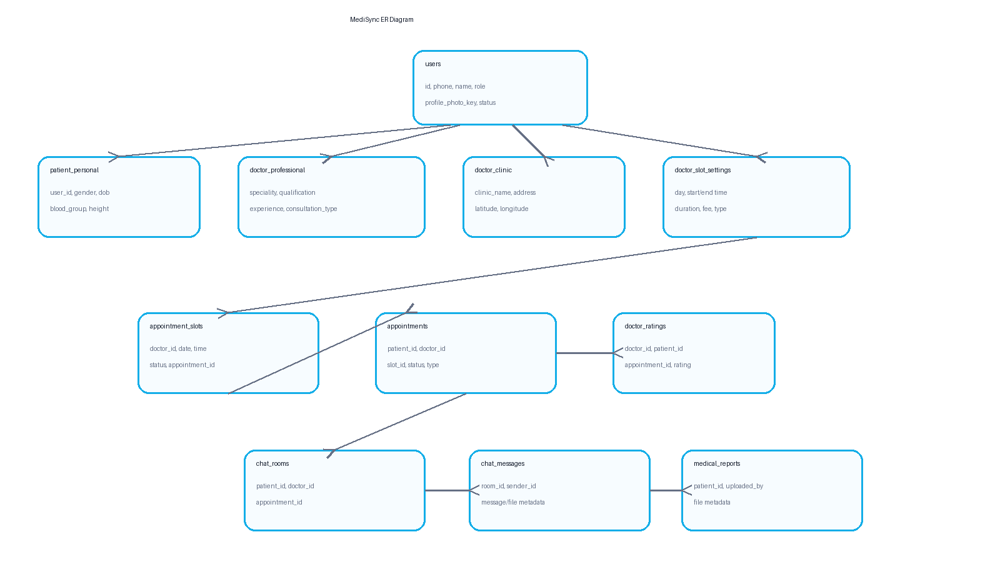
</p>

---

## Project Structure

```text
MediSync/
├── medisync-app/        # Android application
│   └── app/src/main/
│       ├── java/        # Kotlin source code
│       └── res/         # Android resources
│
├── server/              # Node.js backend
│   ├── src/
│   │   ├── config/      # Database, Redis, Firebase, MinIO config
│   │   ├── controllers/ # API controllers
│   │   ├── routes/      # Express routes
│   │   ├── websocket/   # Chat and video WebSocket handlers
│   │   ├── services/    # Notification services
│   │   └── jobs/        # Slot generation jobs
│   └── sql/table/       # Database migration SQL
```

---

## Backend Setup

Go to the backend folder:

```bash
cd server
npm install
npm start
```

Create a `.env` file inside `server/`:

```env
PORT=3000
DB_HOST=localhost
DB_PORT=5432
DB_NAME=medisync
DB_USER=postgres
DB_PASSWORD=your_password

REDIS_HOST=localhost
REDIS_PORT=6379
REDIS_PASSWORD=your_redis_password

JWT_SECRET=your_jwt_secret

MINIO_ENDPOINT=localhost
MINIO_PORT=9000
MINIO_ACCESS_KEY=your_minio_access_key
MINIO_SECRET_KEY=your_minio_secret_key
MINIO_USE_SSL=false
MINIO_PUBLIC_HOST=your_public_host
MINIO_PUBLIC_PORT=9000
MINIO_PUBLIC_USE_SSL=false
```

Run the PostgreSQL migration from:

```text
server/sql/table/migration.sql
```

---

## Android Setup

Open `medisync-app/` in Android Studio.

Update backend URLs in the Android network configuration according to your server IP:

```kotlin
BASE_URL = "http://your-server-ip:3000/"
CHAT_WS_URL = "ws://your-server-ip:3000/chat"
VIDEO_WS_URL = "ws://your-server-ip:3000/video"
```

Add required keys in `local.properties`:

```properties
GOOGLE_MAPS_API_KEY=your_google_maps_key
GEMINI_API_KEY=your_gemini_key
```

Build the app:

```bash
./gradlew :app:assembleDebug
```

---

## Core Modules

### Authentication

Users login with phone OTP. After verification, the backend issues JWT tokens for protected API access.

### Appointment Booking

Patients select available slots. The backend uses PostgreSQL transactions to prevent double booking.

### Chat

Doctor and patient messages are exchanged using WebSockets and persisted in PostgreSQL.

### Video Consultation

Video calling uses WebRTC for media and WebSocket signaling for offer, answer, and ICE candidate exchange.

### Medical Records

Medical files are uploaded to MinIO, while metadata is stored in PostgreSQL. Records can be viewed later from the patient record section.

### AI Health Assistant

Patients can ask health-related questions and analyze selected images or records using Gemini API integration.

---

## Future Scope

- Online payment gateway
- E-prescription generation
- Lab test booking and report delivery
- Insurance claim support
- Hospital admin dashboard
- ML based doctor recommendation
- Multi-language support
- iOS or cross-platform version

---

## Team

MediSync Development Team

---

## License

This project is created for academic and learning purposes.
